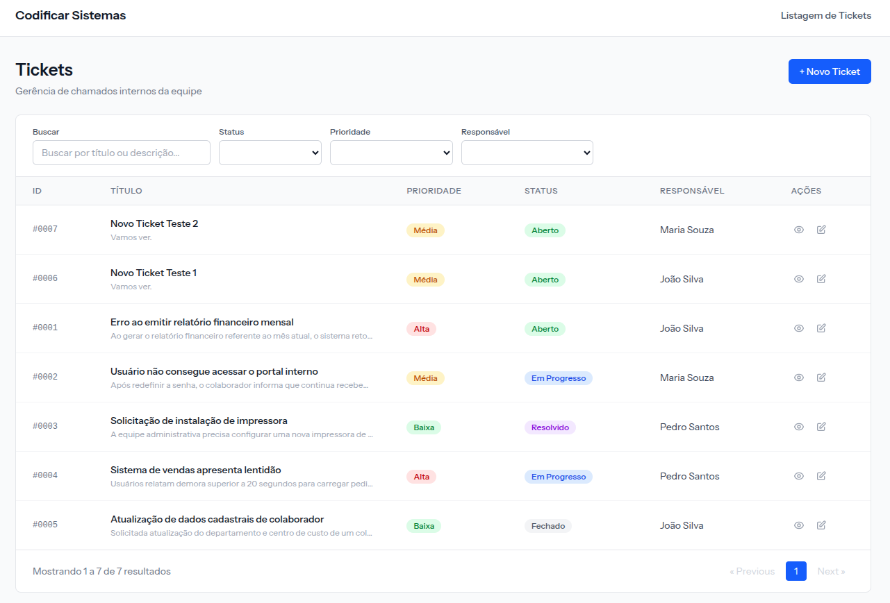
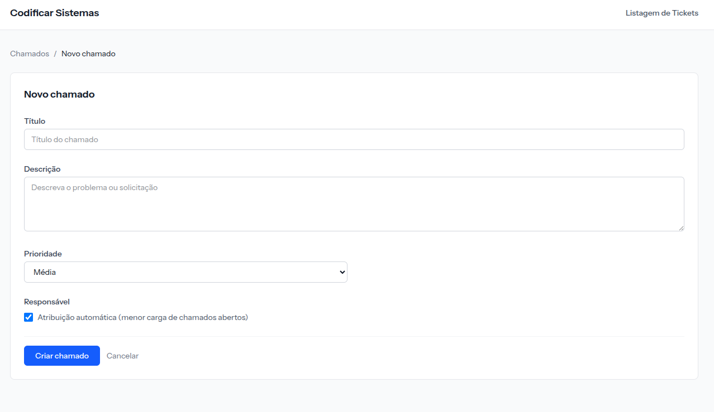
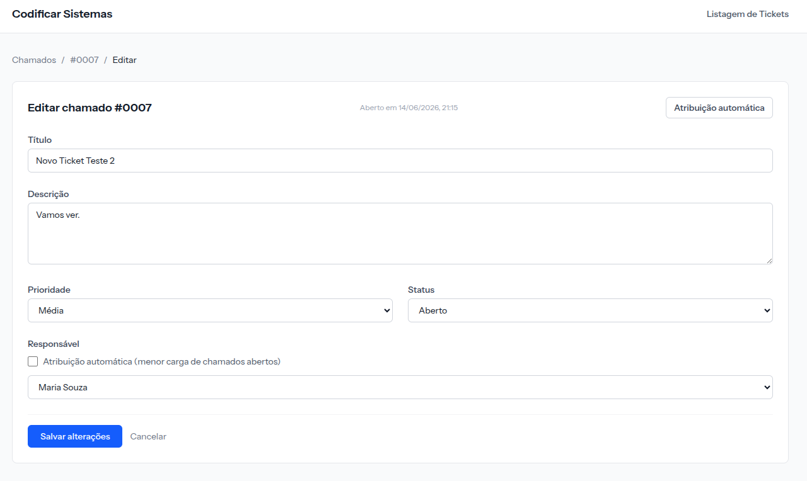
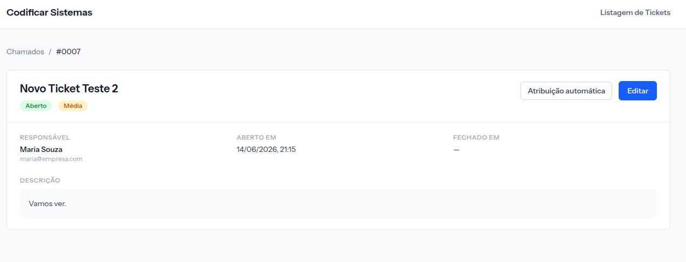

# Sistema de Controle de Chamados Internos

Aplicação web para gerenciamento de chamados internos de equipes, permitindo criar, visualizar, editar e acompanhar solicitações de suporte, com atribuição automática ou manual de responsáveis.

Este projeto foi desenvolvido como solução para o desafio técnico da Codificar Sistemas Tecnológicos.

---

# Funcionalidades Implementadas

## Chamados

* Cadastro de chamados
* Edição de chamados
* Visualização detalhada de chamados
* Listagem de chamados
* Filtros por status
* Filtros por prioridade
* Atribuição manual de responsável
* Atribuição automática de responsável
* Registro da data/hora de abertura
* Registro da data/hora de encerramento

## Responsáveis

* 3 responsáveis disponíveis via seed
* Seleção manual durante criação ou edição
* Utilização na distribuição automática

## Distribuição Automática

* Balanceamento de carga baseado em chamados em aberto
* Critério de desempate por carga de prioridade
* Critério final determinístico por ID

## Qualidade

* Testes automatizados
* Análise estática com PHPStan/Larastan
* Código organizado por responsabilidades
* Regras de negócio isoladas em serviços

---

# Atendimento aos Requisitos do Desafio

| Requisito                       | Status |
| ------------------------------- | ------ |
| Cadastro de chamados            | ✅      |
| Edição de chamados              | ✅      |
| Visualização de chamados        | ✅      |
| Listagem de chamados            | ✅      |
| Título e descrição              | ✅      |
| Prioridade (baixa, média, alta) | ✅      |
| Status do chamado               | ✅      |
| Responsável pelo atendimento    | ✅      |
| Data/hora de abertura           | ✅      |
| Responsáveis disponíveis        | ✅      |
| Pelo menos 3 responsáveis       | ✅      |
| Distribuição automática         | ✅      |
| Distribuição manual             | ✅      |
| Definição de chamados em aberto | ✅      |
| Documentação de instalação      | ✅      |
| Documentação arquitetural       | ✅      |

---

# Stack Tecnológica

| Camada           | Tecnologia         |
| ---------------- | ------------------ |
| Backend          | PHP 8.4 + Laravel  |
| Frontend         | Vue 3 + Inertia.js |
| Estilização      | Tailwind CSS v4    |
| Banco de Dados   | SQLite             |
| Testes           | Pest               |
| Análise Estática | Larastan (PHPStan) |

---

# Por que Laravel + Inertia + Vue?

## Laravel

Laravel oferece uma base sólida para aplicações de negócio através de:

* Eloquent ORM
* Form Requests
* Dependency Injection
* Service Container
* Migrations e Seeders
* Testes integrados

## Inertia.js

O Inertia reduz o atrito entre frontend e backend ao permitir construir uma SPA sem a necessidade de manter uma API REST separada.

Benefícios:

* Menos duplicação de código
* Menos complexidade operacional
* Melhor produtividade para equipes pequenas

## Vue 3

Vue 3 oferece:

* Componentização simples
* Reatividade moderna
* Composition API
* Excelente integração com Inertia

---

# Decisões Arquiteturais

## Service Layer

As regras de negócio foram isoladas em serviços específicos:

```text
app/Services
├── TicketService.php
└── OwnerAssignmentService.php
```

Responsabilidades:

### TicketService

* Criação de chamados
* Atualização de chamados
* Controle de datas de abertura e fechamento
* Integração com distribuição automática

### OwnerAssignmentService

* Seleção automática de responsável
* Aplicação das regras de balanceamento

Os controllers permanecem enxutos, responsáveis apenas por:

* Receber requisições
* Validar entradas
* Acionar serviços
* Retornar respostas

---

## Enums

Foram utilizados enums PHP para evitar strings mágicas:

```php
TicketStatus
TicketPriority
```

Benefícios:

* Segurança de tipos
* Melhor legibilidade
* Centralização de regras relacionadas ao domínio

---

## Controle de Datas

### opened_at

Representa o momento em que o chamado foi aberto pela primeira vez.

### closed_at

Representa o momento em que o chamado foi concluído pela primeira vez.

Esses campos são gerenciados exclusivamente pela camada de serviço.

---

# Estrutura do Projeto

```text
app
├── Enums
├── Http
│   ├── Controllers
        ├── TicketController.php
│   └── Requests
        ├── StoreTicketRequest.php
        ├── UpdateTicketRequest.php
├── Models
    ├── User.php
    ├── Ticket.php
    ├── Owner.php
├── Services
│   ├── TicketService.php
│   └── OwnerAssignmentService.php
└── Providers

resources
└── js
    ├── actions
    ├── components
    ├── pages
    └── layouts
    └── lib
    └── routes
    └── types

tests
├── Feature
└── Unit
```

---

# Status dos Chamados

| Valor       | Descrição    |
| ----------- | ------------ |
| open        | Aberto       |
| in_progress | Em andamento |
| resolved    | Resolvido    |
| closed      | Fechado      |

---

# O que é um Chamado em Aberto?

Para fins de distribuição automática, um chamado é considerado em aberto quando possui status:

* open
* in_progress

Chamados com status:

* resolved
* closed

não participam do cálculo de carga dos responsáveis.

Essa decisão foi tomada porque chamados resolvidos já não demandam esforço operacional contínuo.

---

# Regra de Distribuição Automática

Quando um chamado é criado ou reatribuído sem responsável definido:

1. Conta-se o número de chamados em aberto de cada responsável.
2. Seleciona-se o responsável com menor quantidade.
3. Em caso de empate, utiliza-se a menor carga de prioridade.
4. Persistindo o empate, utiliza-se o menor ID.

---

## Exemplo 1

| Responsável | Chamados em aberto |
| ----------- | ------------------ |
| João        | 2                  |
| Maria       | 1                  |
| Pedro       | 3                  |

Resultado:

```text
Novo chamado → Maria
```

---

## Exemplo 2 (Empate)

| Responsável | Chamados | Peso |
| ----------- | -------- | ---- |
| João        | 2        | 5    |
| Maria       | 2        | 3    |

Resultado:

```text
Novo chamado → Maria
```

---

# Requisitos

* PHP 8.4+
* Composer 2+
* Node.js 20+
* SQLite

---

# Instalação

```bash
git clone <url-do-repositorio>

cd codificar-teste-tecnico

composer install

npm install

cp .env.example .env

php artisan key:generate
```

---

# Configuração do Banco

O projeto utiliza SQLite por padrão.

```bash
touch database/database.sqlite
```

Configure:

```env
DB_CONNECTION=sqlite
```

Executar migrations e seeders:

```bash
php artisan migrate --seed
```

---

# Dados Iniciais

O seeder cria automaticamente:

## Responsáveis

* João Silva
* Maria Souza
* Pedro Santos

## Chamados de Exemplo

* Erro ao emitir relatório financeiro mensal
* Usuário não consegue acessar portal interno
* Solicitação de instalação de impressora
* Sistema de vendas apresenta lentidão
* Atualização de cadastro de colaborador

---

# Rodando a Aplicação

## Desenvolvimento

```bash
composer run dev
```

ou

```bash
php artisan serve
npm run dev
```

Acesse:

```text
http://localhost:8000
```

---

# Build de Produção

```bash
npm run build

php artisan optimize
```

---

# Como Avaliar Rapidamente

Após executar os seeders:

1. Acesse a listagem de chamados
2. Verifique os 3 responsáveis cadastrados
3. Crie um chamado utilizando atribuição automática
4. Observe a seleção automática do responsável com menor carga
5. Edite um chamado e altere seu status
6. Execute os testes automatizados

```bash
php artisan test
```

---

# Testes

Executar todos os testes:

```bash
php artisan test
```

Executar testes específicos:

```bash
php artisan test --filter=TicketServiceTest

php artisan test --filter=TicketHttpTest
```

---

## Cobertura

| Arquivo           | Objetivo               |
| ----------------- | ---------------------- |
| TicketTest        | Model e regras básicas |
| TicketServiceTest | Regras de negócio      |
| TicketHttpTest    | Fluxos HTTP e CRUD     |

---

# Bibliotecas Externas

| Biblioteca                | Finalidade                   |
| ------------------------- | ---------------------------- |
| inertiajs/inertia-laravel | Integração Laravel + Inertia |
| @inertiajs/vue3           | Cliente Vue                  |
| laravel/wayfinder         | Rotas tipadas                |
| pestphp/pest              | Testes                       |
| larastan/larastan         | Análise estática             |
| laravel/pint              | Padronização de código       |
| tailwindcss               | Estilização                  |

---

# Capturas de Tela

Adicione aqui imagens das principais telas:

* Listagem de Chamados

* Criação de Chamado

* Edição de Chamado

* Visualização de Chamado


---

# Trade-offs e Melhorias Futuras

## Trade-offs

* SQLite como banco padrão para simplificar a execução local
* Sem autenticação por estar fora do escopo do desafio
* Sem histórico completo de auditoria para priorizar funcionalidades principais

## Melhorias Futuras

* Docker para ambiente isolado
* Autenticação e autorização
* Comentários por chamado
* Histórico de alterações
* Notificações por e-mail
* API REST para integrações externas
* Dashboard gerencial com métricas operacionais

---

# Autor

Desenvolvido por Higor Zica como parte do processo seletivo da Codificar Sistemas Tecnológicos.
